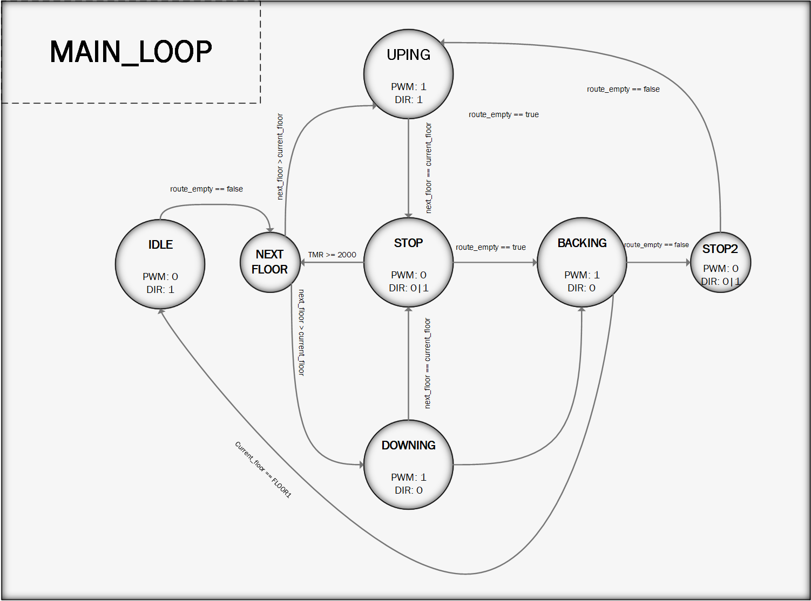
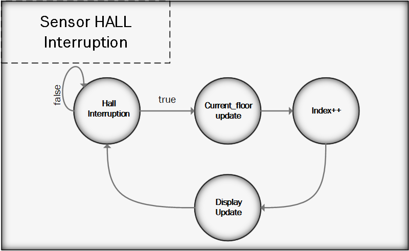
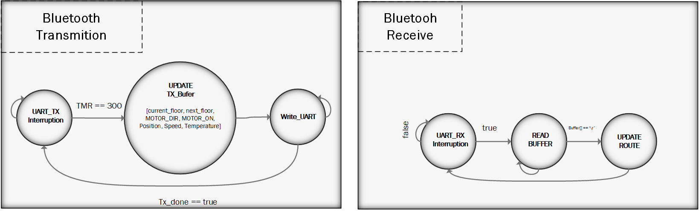

# Sistema de Controle de Elevador

Este repositório contém a lógica de controle para um sistema de elevador, descrevendo os diferentes estados operacionais e suas transições.

---

## Representação Visual do Sistema

## Estados Operacionais do Elevador

### **IDLE**
É o estado inicial e de repouso do elevador. Ele permanece **parado no primeiro andar**, aguardando novas solicitações. Neste estado, o **PWM é desligado** e o pino **DIR é configurado como 1** (para indicar que, ao ligar o PWM, o motor subirá). A condição para sair do estado IDLE é a existência de destinos no vetor `Route`, ou seja, quando `route_empty == false`.

### **NEXT FLOOR**
Esta é uma operação crucial executada no **loop principal** do sistema. Ela lê o vetor `route` (que contém todo o percurso a ser percorrido) e determina qual será o **próximo destino**.
* Se `next_floor > current_floor`, o pino **DIR é setado com 1** (para subir).
* Se `next_floor < current_floor`, o pino **DIR é definido como 0** (para descer).

### **UPING**
Este estado indica que o elevador está **subindo**. O **PWM está ligado** e o pino **DIR é 1**. O elevador permanecerá neste estado até que atinja o andar definido pela variável `next_floor`. Ao atingir o andar desejado, o elevador transita para o estado **STOP**.

### **DOWNING**
Semelhante ao estado UPING, porém, o pino **DIR é 0** para que o elevador **desça**. Quando o elevador atinge o andar desejado, apontado por `next_floor`, ele também transita para o estado **STOP**.

### **STOP**
Estado em que o elevador permanece **parado por 2 segundos**. Este atraso simula o tempo em que a porta do elevador ficaria aberta para embarque ou desembarque de pessoas. Após o término da espera, o sistema calcula novamente o `next_floor`.

### **BACKING**
Este estado ocorre quando o elevador **terminou de atender todas as solicitações** na fila `Route`. O objetivo é **retornar para a posição inicial no primeiro andar**. Neste estado, o **PWM está ligado** e o pino **DIR é 0** (para descer). Ao chegar à sua posição inicial, o elevador transita para o estado **IDLE**.

### **STOP2**
Este estado representa uma **espera de 0.5 segundos** e é acionado caso o elevador receba alguma nova solicitação de subida enquanto estiver retornando para o estado inicial (BACKING).

---

## Interrupção Sensor Hall

## Comunicação UART

---

